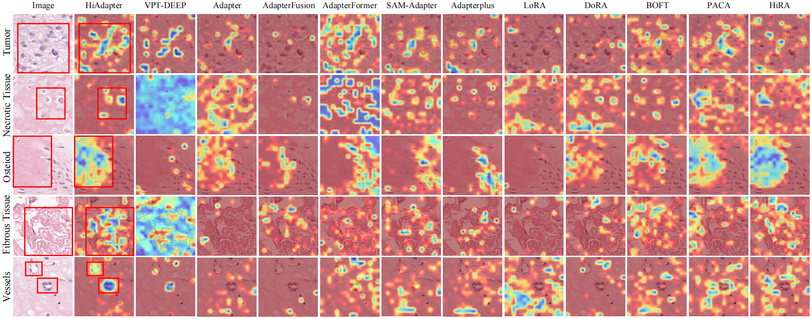

<h2 class="papername">HiAdapter: Histopathology-induced Adapter for Pathology Foundation Models </h2>


## Updates
+ TODO: Add code ✔

+ TODO: Add OSPatch

## Abstract

With the rapid development of pathology foundation models, there is a growing demand for efficient fine-tuning strategies tailored to downstream tasks. However, existing parameter-efficient fine-tuning approaches are largely task-agnostic and exhibit limited generalization to histopathological images, particularly for unseen cancers and unseen stains, due to substantial stain variability and the complexity of tissue microenvironments.  
To address these challenges, we present **Histopathology-induced Adapter (HiAdapter)**, which incorporates domain-specific insights into the staining and imaging mechanisms of histopathology. HiAdapter reconstructs stain-invariant representations via a stain-aware adapter and integrates morphology-aware features through a morphology adapter, effectively bridging the gap between low-level optical properties and high-level tissue semantics. Additionally, we introduce a Pathology Prototypical Contrastive Loss to reduce inter-class similarity and mitigate intra-class heterogeneity, enhancing feature discriminability.  
Extensive experiments using **three** representative pathology foundation models (CTransPath, CONCH, and UNI) across **five** benchmarks, including two public datasets, an osteosarcoma tissue classification dataset (56,178 patches) and a chondrosarcoma necrosis classification dataset (3867 patches) for unseen cancer generalization, as well as an IHC-stained dataset (4967 patches) for unseen stain generalization, demonstrate the effectiveness of HiAdapter in both efficiency and accuracy. HiAdapter achieves an average improvement of **2.15 in F1 and 1.55 in accuracy** over the second-best performer, maintaining strong biological and diagnostic interpretability. Moreover, external validation on an independent osteosarcoma dataset (9535 patches) and WSI-level survival analysis (178 slides) further confirm its superior generalization and underscore its potential for patient-level diagnosis and prognosis in clinical practice.  

The framework of the proposed HiAdapter:


## Enhanced Interpretability

Compared to other PEFT baselines, which generally display diffuse and inconsistent attention patterns with poor localization of biologically relevant structures, HiAdapter consistently generates sharper, spatially coherent maps that align with both localized cellular features and broader tissue architectures.



## Data Link
+ SPIDER dataset: [here](https://github.com/HistAI/SPIDER)
+ OSPatch dataset: coming soon~

```python
├── OSPatch
│   ├── split_6
│   │   ├── train_fold_0.txt
│   │   └── val_fold_0.txt
│   │   └── test.txt
│   └── 6classes
│       ├── 0
│       ├── 1
│       ├── ...
│       ├── nuclei
│       └── non
```

## Quick Start
```python
python train.py


